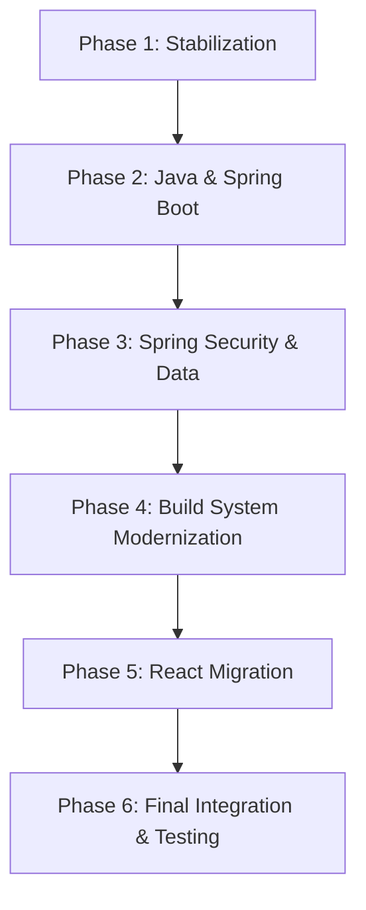

# Legacy Application Modernization Design

## Overview

This design document outlines the technical approach for modernizing the Bootlace legacy web application from a 2015 technology stack to current modern technologies. The modernization will be executed in carefully planned phases to ensure the application remains functional throughout the process.

### Current State Analysis

**Backend Stack (2015):**
- Java 8
- Spring Boot 1.2.3.RELEASE
- Spring Security (legacy version)
- Spring Data MongoDB (legacy version)
- Maven 3.x build system

**Frontend Stack (2015):**
- AngularJS 1.3
- Node.js 4.9.1
- npm 2.15.11
- Browserify build system
- jQuery 2.1
- Bootstrap 3.3

**Target State:**
- Java 21 (LTS)
- Spring Boot 3.x
- Spring Security 6.x
- Spring Data MongoDB 4.x
- React 18+
- Node.js 20+ (LTS)
- Modern build tooling (Vite/Webpack)

## Architecture

### Migration Strategy: Backend-First Approach

After analyzing the dependencies and risks, the optimal migration strategy is to modernize the backend first, then the frontend. This approach provides several advantages:

1. **Stable API Foundation**: Modernizing the backend first ensures we have a solid, modern API foundation
2. **Reduced Risk**: Backend changes are less visible to end users and easier to test
3. **Independent Testing**: Backend can be thoroughly tested before frontend migration begins
4. **Gradual Transition**: Frontend can continue working with the old stack while backend is modernized

### Phase-by-Phase Architecture



## Components and Interfaces

### Phase 1: Application Stabilization

**Objective**: Get the current application running reliably

**Components**:
- Fix immediate build issues in existing npm/browserify setup
- Resolve Node.js compatibility problems
- Ensure MongoDB connectivity
- Verify basic application functionality

**Key Changes**:
- Minimal package.json fixes for compatibility
- Build script adjustments for Windows environment
- Database connection verification

### Phase 2: Java and Spring Boot Modernization

**Objective**: Upgrade core Java and Spring Boot infrastructure

**Components**:
- **Java Runtime**: Upgrade from Java 8 to Java 21
- **Spring Boot**: Upgrade from 1.2.3 to 3.x
- **Maven Configuration**: Update pom.xml with modern dependencies
- **Application Configuration**: Migrate to new Spring Boot configuration patterns

**Key Changes**:
```xml
<!-- From -->
<parent>
    <groupId>org.springframework.boot</groupId>
    <artifactId>spring-boot-starter-parent</artifactId>
    <version>1.2.3.RELEASE</version>
</parent>

<!-- To -->
<parent>
    <groupId>org.springframework.boot</groupId>
    <artifactId>spring-boot-starter-parent</artifactId>
    <version>3.2.x</version>
</parent>
```

**Migration Considerations**:
- Update package imports (javax.* to jakarta.*)
- Modernize configuration properties
- Update actuator endpoints
- Verify Jetty compatibility with Spring Boot 3.x

### Phase 3: Spring Security and Data Layer Modernization

**Objective**: Update security and database access layers

**Components**:
- **Spring Security**: Upgrade to 6.x with modern configuration
- **Spring Data MongoDB**: Update to 4.x with current syntax
- **Authentication Flow**: Maintain existing JWT/session-based auth
- **Repository Layer**: Update to modern Spring Data patterns

**Security Configuration Migration**:
```java
// Modern Spring Security Configuration
@Configuration
@EnableWebSecurity
public class SecurityConfiguration {
    
    @Bean
    public SecurityFilterChain filterChain(HttpSecurity http) throws Exception {
        return http
            .authorizeHttpRequests(auth -> auth
                .requestMatchers("/api/public/**").permitAll()
                .anyRequest().authenticated()
            )
            .oauth2ResourceServer(OAuth2ResourceServerConfigurer::jwt)
            .build();
    }
}
```

**Data Layer Updates**:
- Update MongoDB repository interfaces
- Modernize entity annotations
- Update query syntax to current Spring Data MongoDB patterns

### Phase 4: Build System and Frontend Tooling Modernization

**Objective**: Replace legacy Node.js build system with modern tooling

**Components**:
- **Node.js**: Upgrade to 20+ LTS
- **Package Manager**: Use npm 10+ or yarn
- **Build Tool**: Replace Browserify with Vite or Webpack
- **Development Server**: Modern dev server with HMR
- **Asset Processing**: Modern CSS/JS processing pipeline

**New Build Architecture**:
```json
{
  "scripts": {
    "dev": "vite",
    "build": "vite build",
    "preview": "vite preview",
    "test": "jest"
  },
  "devDependencies": {
    "vite": "^5.0.0",
    "@vitejs/plugin-react": "^4.0.0"
  }
}
```

### Phase 5: React Migration

**Objective**: Migrate from AngularJS 1.3 to React 18+

**Components**:
- **React Setup**: Modern React 18+ with hooks and functional components
- **Routing**: React Router for SPA navigation
- **State Management**: Context API or Zustand for application state
- **HTTP Client**: Axios or fetch for API communication
- **UI Components**: Modern component library (Material-UI or similar)

**Component Architecture**:
```
src/
├── components/
│   ├── common/
│   ├── auth/
│   └── profile/
├── hooks/
├── services/
├── utils/
└── App.jsx
```

**Authentication Integration**:
```javascript
// Modern React authentication hook
const useAuth = () => {
  const [user, setUser] = useState(null);
  const [loading, setLoading] = useState(true);
  
  const login = async (credentials) => {
    const response = await authService.login(credentials);
    setUser(response.user);
    return response;
  };
  
  return { user, login, logout, loading };
};
```

### Phase 6: Final Integration and Testing

**Objective**: Complete integration testing and production readiness

**Components**:
- **End-to-End Testing**: Comprehensive testing of all functionality
- **Performance Optimization**: Bundle optimization and performance tuning
- **Documentation**: Updated deployment and development documentation
- **CI/CD Updates**: Modern build and deployment pipelines

## Data Models

### Existing Data Models (Preserved)

The current MongoDB data models will be preserved during migration:

```java
// User entity - maintained structure
@Document(collection = "users")
public class User extends AbstractAuditableEntity {
    private String username;
    private String password;
    private String email;
    private Set<Role> roles;
    // ... existing fields preserved
}
```

### Migration Considerations

- **Backward Compatibility**: All existing data structures maintained
- **Index Preservation**: Existing MongoDB indexes preserved
- **Audit Fields**: Existing audit trail functionality maintained
- **Validation**: Modern validation annotations applied

## Error Handling

### Backend Error Handling

**Modern Spring Boot Error Handling**:
```java
@ControllerAdvice
public class GlobalExceptionHandler {
    
    @ExceptionHandler(ValidationException.class)
    public ResponseEntity<ErrorResponse> handleValidation(ValidationException ex) {
        return ResponseEntity.badRequest()
            .body(new ErrorResponse("VALIDATION_ERROR", ex.getMessage()));
    }
}
```

### Frontend Error Handling

**React Error Boundaries and Global Error Handling**:
```javascript
// Global error context for React
const ErrorProvider = ({ children }) => {
  const [errors, setErrors] = useState([]);
  
  const addError = (error) => {
    setErrors(prev => [...prev, { id: Date.now(), ...error }]);
  };
  
  return (
    <ErrorContext.Provider value={{ errors, addError }}>
      {children}
    </ErrorContext.Provider>
  );
};
```

### Migration-Specific Error Handling

- **Graceful Degradation**: Ensure application remains functional during partial migrations
- **Rollback Procedures**: Clear rollback steps for each phase
- **Monitoring**: Enhanced logging during migration phases
- **User Communication**: Clear error messages during transition periods

## Testing Strategy

### Backend Testing

**Unit Testing**:
- JUnit 5 for modern Java testing
- Mockito for mocking dependencies
- TestContainers for integration testing with MongoDB

**Integration Testing**:
```java
@SpringBootTest
@Testcontainers
class UserControllerIntegrationTest {
    
    @Container
    static MongoDBContainer mongodb = new MongoDBContainer("mongo:7.0");
    
    @Test
    void shouldCreateUser() {
        // Integration test with real MongoDB
    }
}
```

### Frontend Testing

**Component Testing**:
- Jest for unit testing
- React Testing Library for component testing
- MSW (Mock Service Worker) for API mocking

**End-to-End Testing**:
- Playwright or Cypress for E2E testing
- Cross-browser compatibility testing

### Migration Testing Strategy

1. **Phase Validation**: Each phase must pass all existing tests
2. **Regression Testing**: Comprehensive regression suite after each phase
3. **Performance Testing**: Ensure performance is maintained or improved
4. **Security Testing**: Verify security features work with new versions

## Implementation Phases

### Phase Sequencing Rationale

**Why Backend-First**:
1. **API Stability**: Modern backend provides stable API for frontend migration
2. **Risk Mitigation**: Backend changes are less risky and easier to test
3. **Dependency Management**: Frontend depends on backend, not vice versa
4. **Team Efficiency**: Backend and frontend teams can work in parallel after Phase 3

### Success Criteria for Each Phase

**Phase 1 Success**: Application runs and basic functionality works
**Phase 2 Success**: All backend functionality works with Java 21 and Spring Boot 3.x
**Phase 3 Success**: Authentication and data access work with modern Spring versions
**Phase 4 Success**: Modern build system produces working frontend assets
**Phase 5 Success**: React frontend provides all AngularJS functionality
**Phase 6 Success**: Complete application passes all tests and is production-ready

### Risk Mitigation

- **Incremental Commits**: Each working state committed to version control
- **Feature Flags**: Use feature flags for gradual rollout of new components
- **Parallel Environments**: Maintain old and new versions during transition
- **Automated Testing**: Comprehensive test suite prevents regressions
- **Documentation**: Detailed migration notes for troubleshooting